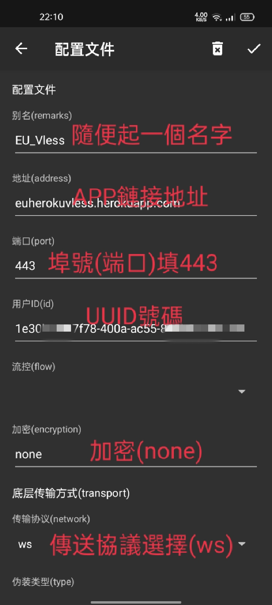
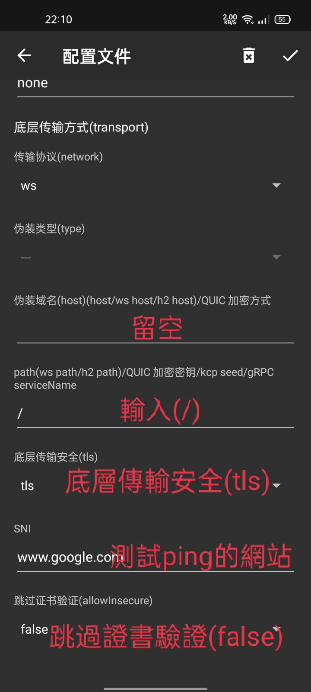

# 用安卓手機搭建私人VPN

用到的鏈接

1. Heroku https://signup.heroku.com/
2. Github https://github.com/
3. Cloudflare https://dash.cloudflare.com/
4. UUID https://www.uuidgenerator.net/

老哥的項目

https://github.com/rptec/heroku-vless
# v2rayNG軟件 下載
到playstore 搜索
或者到以下項目地址下載
https://github.com/2dust/v2rayNG/releases

# v2rayNG 配置
大家參照物下面的圖片設置參數
  

